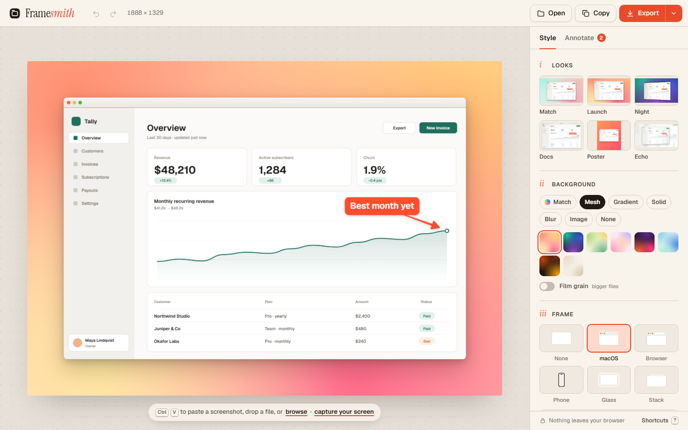

# Framesmith

**Beautiful screenshots in seconds. Free, private, right in your browser.**

Paste a screenshot and get a share-ready image: backgrounds, window frames, 3D tilt,
arrows, labels, redaction, and the exact sizes X, LinkedIn and Instagram want. Then copy it
straight into the composer.

**Live:** https://framesmith.pages.dev



## Why

Tools like Xnapper, Shots.so and CleanShot X charge $5–$29/month for one job: turning a raw
screenshot into something you'd post. Framesmith does that job for free. It needs no account,
uploads nothing and is fast enough to stay part of your posting routine.

| | Xnapper / Shots.so / CleanShot | Framesmith |
|---|---|---|
| Price | $5–$29 / month | Free |
| Account | Required | None |
| Your screenshots | Uploaded, or stuck in a native app | Never leave your browser |
| Platforms | macOS app, or web with a paywall | Any modern browser, installable as an app |

## What it does

- **Paste, drop, open or capture.** Use <kbd>Ctrl/⌘ V</kbd>, drag and drop, a file picker, or
  grab a window straight from your screen. On phones, *Share → Framesmith* works once it's
  installed.
- **Looks.** One-click presets rendered live *with your own screenshot*, so you can see the
  result before you pick it.
- **Match backgrounds.** Framesmith reads the accent colours out of your screenshot and builds a
  mesh that belongs with it, in soft, vivid, deep or duotone. Every shot gets its own palette.
- **More backgrounds.** Mesh gradients, linear gradients, solids with a custom picker, a blurred
  copy of your screenshot, your own wallpaper, or transparent. Film grain is optional.
- **Frames.** macOS window, browser window with an editable URL, a phone with bezel and
  dynamic island (light or dark), glass border and stacked cards. Tall screenshots get the
  phone automatically, and the looks adapt too.
- **Crop and place.** Crop with ratio lock and auto-trim (<kbd>C</kbd>). Drag the shot anywhere
  on the canvas, or let it bleed off an edge, with centre snapping. Annotations stay pinned to
  their pixels through every crop.
- **Signature.** An optional `@handle` badge in a bottom corner.
- **3D tilt.** A true perspective warp with a matching shadow and sheen. It's not a CSS trick,
  so it exports exactly as you see it.
- **Canvas sizes.** Auto, 16:9 (X), 1.91:1 (Open Graph/LinkedIn), 4:3, 1:1, 4:5 and 9:16. The
  shot is never cropped.
- **Trim empty edges.** Automatically removes the uniform margin around a sloppy capture.
- **Annotate.** Tapered arrows, boxes, highlighter, text labels, auto-numbered steps,
  spotlight, and redaction that pixelates for real (the original pixels are not in the
  export). Everything is movable, reshapable and recolorable.
- **Export.** Auto picks PNG, or switches to JPEG/WebP when a PNG would go over X's 5 MB upload
  limit and tells you what it saved. PNG, JPEG or WebP are also available at 1×/2×/3×. Copy to
  clipboard in one keystroke.
- **Undo everything.** Full undo/redo history with Undo buttons right in the notifications,
  keyboard-first (`V A R H T N B F C`, <kbd>⌘Z</kbd>, <kbd>⌘C</kbd>, <kbd>⌘S</kbd>, <kbd>?</kbd>
  for the cheat sheet).
- **Picks up where you left off.** Your last screenshot, crop, annotations and style come back
  after a reload (stored in IndexedDB on your device). Saved styles persist too. Works offline
  as an installable PWA, with light and dark themes.

## How it's built

Zero runtime dependencies and zero build step: plain ES modules, one stylesheet and a
`<canvas>`. The whole app is about 35 KB gzipped.

```
public/
  index.html          editor shell + SVG icon sprite
  styles.css          design tokens (OKLCH), light/dark, responsive
  sw.js               offline cache + Web Share Target
  js/
    layout.js         pure geometry: padding, aspect, chrome, perspective projection
    render.js         one renderer for preview and export (background → shadow → card → tilt)
    backgrounds.js    procedural gradients, meshes, grain, blur
    annotations.js    annotation model, hit-testing, handles (pure)
    crop.js           crop rectangle math with ratio lock (pure)
    palette.js        accent-colour extraction + Match background builder (pure)
    session.js        last-session persistence in IndexedDB
    trim.js           uniform-border detection (pure)
    history.js        snapshot undo/redo (pure)
    demo.js           a hand-drawn sample screenshot so first load is never empty
    main.js           UI wiring
tests/core.test.js    node:test suite for the pure modules
tools/og.html         renders public/og.png with the real renderer
```

A few details worth knowing:

- **Preview and export share one code path.** `render()` takes a scale factor. The preview
  draws at `fit × devicePixelRatio` and the export at 1–3×, so what you see is what you get,
  pixel for pixel.
- **The tilt is a real perspective projection, supersampled.** It warps a 2× card and
  downsamples, so tilted text stays crisp. It walks the *output* columns, inverts the
  projection to find the source column each one sees, and samples it. That means no seams and
  no overlap. The result is fitted back into the original card box, so tilting never changes
  the layout.
- **Shadows use an off-canvas trick.** The card shape is drawn 50,000 px off-screen and only
  its shadow is offset back into view, so translucent frames and rounded corners never show a
  fill behind them.
- **Match reads colour, not area.** Screenshots are mostly white and grey UI, so pixels are
  binned and scored by saturation squared times frequency. The accent colour wins over the
  page background, and near-duplicate hues merge. Grey UIs fall back to a warm palette.
- **Canvas size is capped at 16 MP**, Safari's limit, so large 3× exports never fail silently.
  The export menu shows the capped size.

## Run it locally

```bash
npm run dev     # python -m http.server 5190 -d public, then open http://localhost:5190
npm test        # node --test, no dependencies
```

Any static file server works. There is nothing to install.

## Deploy

```bash
npm run deploy  # wrangler pages deploy public --project-name framesmith
```

## License

MIT
